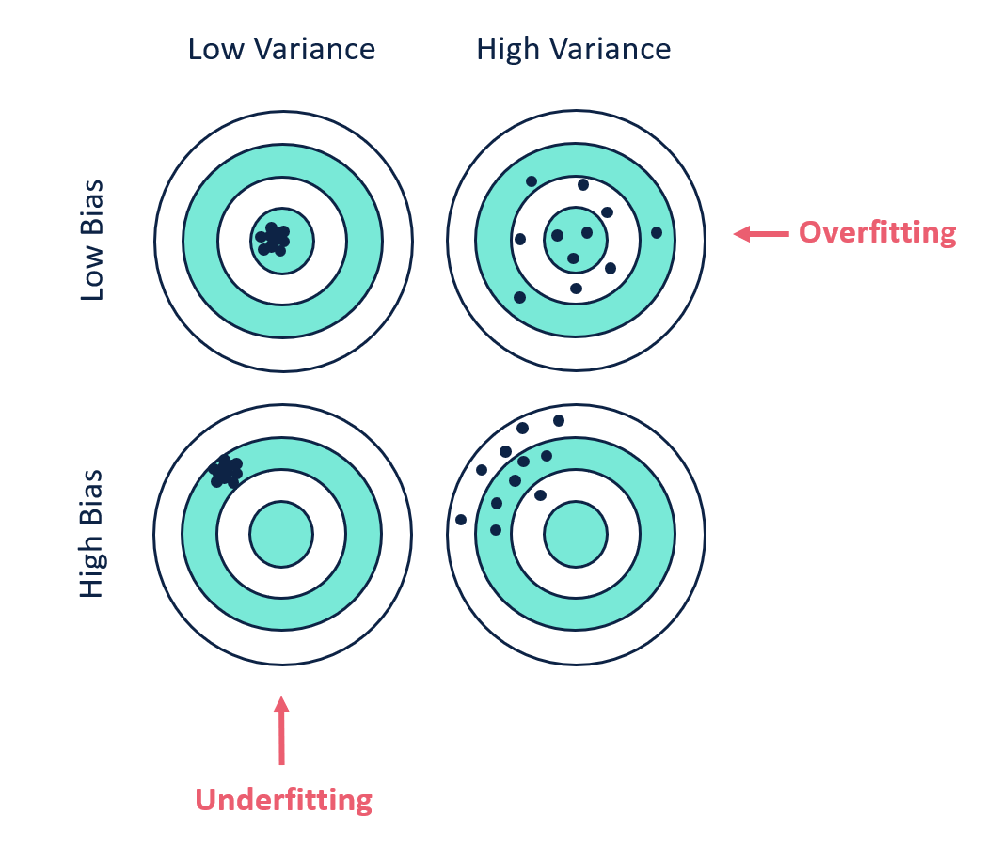
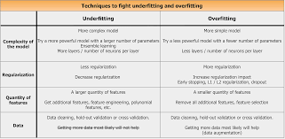

# ML-study
## Referrence
### others
* ```Readmd markdown``` ->  https://github.com/tchapi/markdown-cheatsheet/blob/master/README.md
* ```Tensorflow 2.x```  ->  https://github.com/ryanxjhan/TensorFlow-2.x-Cheat-Sheet/blob/main/README.
* ```start``` -> https://machinelearningmastery.com/start-here/#deeplearning
### regression
* `regression keras` -> https://machinelearningmastery.com/regression-tutorial-keras-deep-learning-library-python/


md#layers

## Definitions

```Bias:``` It measures the difference between the model’s prediction and the target value. If the model is oversimplified, the predicted value would be far from the ground truth resulting in more bias.

```Variance:```Variance measures the inconsistency of different predictions over a varied dataset. Suppose the model's performance is tested on different datasets—the closer the prediction, the lesser the variance. Higher variance indicates overfitting, in which the model loses the ability to generalize.



```Underfitting:```Model performs poor on training data and unseen data. This happens when model is trained on less amount of data.

```Overfitting:```Performs well on training data but fails on unseen data. This happens when the model is overtrained on the training dataset having more noise.




